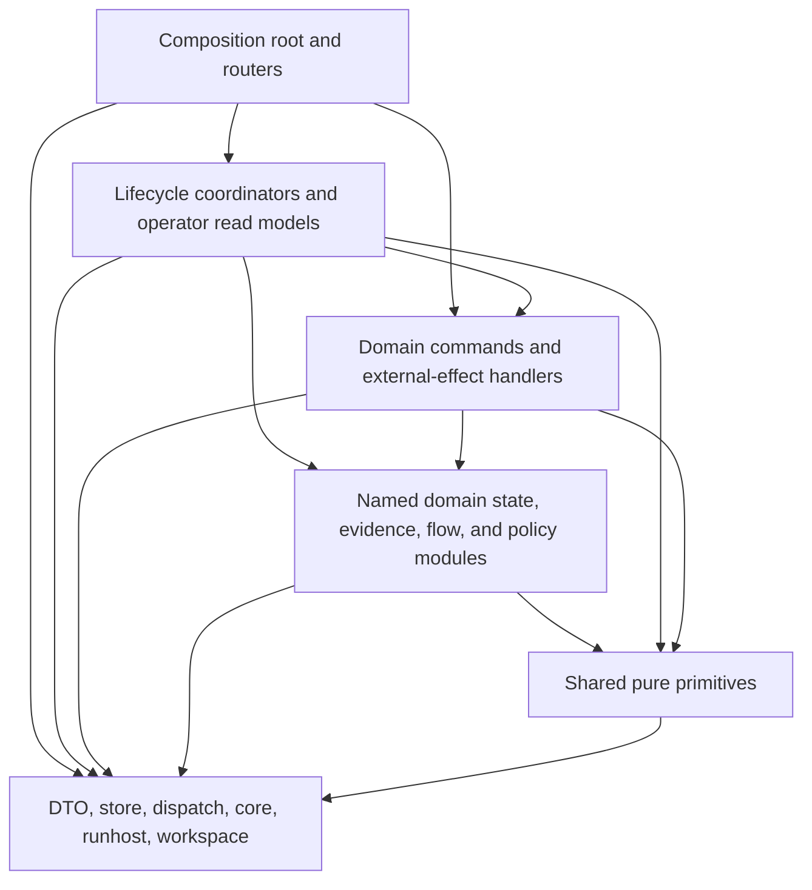

# PHarness API application module dependency graph

Date: 2026-08-21  
Scope: `crates/pharness-api/src/app` after decomposition D9

## Result

The application tree contains 73 Rust modules and 359 explicit intra-application import edges. The generated graph has no strongly connected component after excluding the composition root. The composition root is intentionally excluded because it owns `AppState`, `ApiError`, and router assembly while mounted modules import those root-owned types.

Current enforced limits:

- `app/mod.rs`: 185 lines, limit 1,500.
- Largest production module: `work_items/reconcile.rs`, 2,698 lines, limit 3,500.
- Largest test module: `tests/production.rs`, 2,391 lines, limit 4,000.
- Wildcard imports/re-exports: none.
- Generic `utils.rs` modules: none.
- Production and test import cycles: none.

Run `scripts/app-module-dependencies.py --format mermaid` for the complete generated edge graph, `scripts/app-module-dependencies.py` for TSV, and `scripts/check-app-module-boundaries.sh` for the enforced check.

## Architectural dependency direction

The allowed direction is downward:

1. `app/mod.rs` owns only composition, shared application state, and the API error adapter.
2. Lifecycle coordinators such as WorkItem reconciliation, action flow, approvals, releases, and SDLC read assembly may call domain commands and named domain read/state modules.
3. External-effect handlers for source delivery, Pipeline execution, GitOps delivery, and deployment execution may depend on named domain state, policy, validation, and evidence modules. They must not import a lifecycle coordinator.
4. Cross-domain dependencies must target a named, bounded interface such as `pipeline/evidence.rs`, `pipeline/readiness.rs`, `gitops/delivery_flow.rs`, `gitops/deployment_evidence.rs`, or `deployment/target.rs`; command-handler modules are not shared-helper facades.
5. Shared primitives such as `clock`, `hashing`, `identifiers`, `json_values`, `risk`, `text`, and `validation` remain leaf modules and cannot import lifecycle or effectful handlers.
6. Tests may import production modules and `tests/support.rs`. Production code must never import test modules, and test modules must not import one another in a cycle.

## Ownership changes that removed the final cycles

- Source and GitOps delivery response assembly moved into `source/delivery_flow.rs` and `gitops/delivery_flow.rs`.
- GitOps deployment provenance and target checks moved into `gitops/deployment_evidence.rs`.
- Pipeline evidence, deployment readiness, handoff, and execution state moved into separately named modules.
- Deployment target parsing and exact WorkItem matching moved into `deployment/target.rs`.
- WorkItem reconcile actions and controller-wait persistence moved into `work_items/reconcile_model.rs` and `work_items/wait_state.rs`.
- Approval gate parsing and dedicated-action policy moved below lifecycle orchestration into `approval_policy.rs`.
- Shared test fixtures moved into `tests/support.rs`, removing the last test-module cycle.

These are ownership moves only. Routes, request/response types, lifecycle transitions, policy decisions, and external-effect boundaries remain unchanged.
