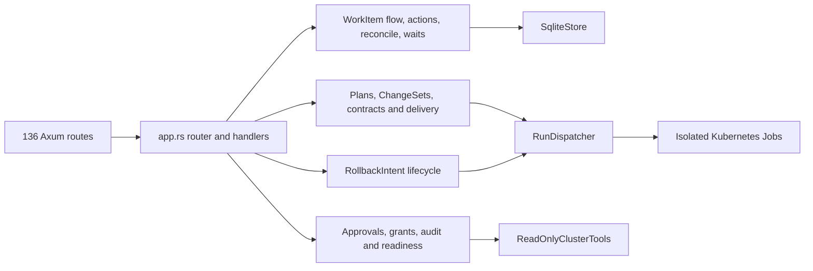

# PHarness `app.rs` Behavior-Preserving Decomposition Milestone

Date: 2026-08-21

Execution baseline: `v3-environment-ready`

## Outcome

Decompose `crates/pharness-api/src/app.rs` into domain-owned modules without
changing public routes, serialized contracts, lifecycle decisions, policy
boundaries, durable event shapes, executor dispatches, or external effects.
This is a maintainability milestone, not a feature milestone.

The work must be executable as a sequence of small pull requests. Each pull
request has one extraction boundary, preserves behavior, and leaves `main`
deployable. GPT-5.6 Terra should execute one pull request at a time and stop if
characterization evidence changes unexpectedly.

## Frozen V3 characterization baseline

The baseline is the annotated tag `v3-environment-ready` at release commit
`1aedc319e30c04f6fabfbb1ac6bde0f2f6cc3ec9`. The compiled source revision is
`97d2935933b872b76f7a2d8aa98e82d72f1f4e17`.

Immutable PHarness artifacts:

- Runtime: `sha256:0b8a64e847b1558ee976364a1b615576cb9acf8b8c32a3c675ef59c810c7341b`
- UI: `sha256:e886457a846a19317fcdef8b291be634f85ac80dbb7b14b20de01991610ed3e4`
- Python runner: `sha256:abde65aab67c3f0b72da5bca0b211af66f9946dc5e291a2b63818e38f90f214b`

Live characterization records that must remain readable and unchanged:

- WorkItem: `witem_1787004039044254173`, status `completed`
- Coding Run: `run_1787004203328241892`, completed in 17 turns
- ChangeSet: `cset_1787004508444691023`
- PipelineIntent: `pint_1787016647224861723`
- DeploymentIntent: `dint_1787080944735948442`
- GitOps ChangeSet: `gcset_1787081054969085069`
- Release: `rel_1787319729524364759`, status `completed`
- RollbackIntent: `rollback_1787101080007131097`, status `approved`
- Source merge: `da4e3cd8a4c33d2b359e4e521525203da32ecf18`
- GitOps merge: `97f2446322fea0ac874028085841c8d818213c64`
- Running yfinance digest: `sha256:f1cfc06fcac62d7c37a4d7dc87237e2abe02df0d9c3824a7521c5359058879c1`
- Rollback baseline digest: `sha256:850341f37100a0e90711b54733e06eeb52cb268244c6bbc07c25ef1b3c932cce`

The RollbackIntent deliberately has no writer execution or pull request. Its
exact digest-bound writer action is ready, proving rollback readiness without
executing a rollback. Do not advance it during decomposition testing.

## Current shape

`app.rs` is 42,859 lines and contains 573 top-level functions, types, or impls.
Production code occupies roughly the first 28,637 lines; the in-module test
suite occupies the remainder. The file mounts 136 routes and coordinates
authentication, read models, WorkItems, reconciliation, approvals, contracts,
source delivery, Tekton, GitOps, Argo, releases, rollback, audit evidence, and
tests.



The problem is not that these capabilities exist. The problem is that their
route wiring, decisions, persistence orchestration, and tests share one Rust
module boundary and one import surface.

## Non-negotiable behavior invariants

Every extraction must preserve all of the following:

1. Every HTTP method and path, middleware layer, authentication rule, status
   code, response JSON shape, and externally meaningful error message.
2. Exact lifecycle states, action IDs, action ordering, state-hash inputs,
   blockers, approval requirements, and safe-advance stopping rules.
3. Every immutable provenance check and exact protected-production-target
   comparison.
4. Permission-grant subjects, scopes, expiry rules, and all scope dimensions.
5. Audit event kinds, actors, resource bindings, artifact kinds, and durable
   content shapes.
6. Idempotency, stale-preview rejection, controller-wait scheduling, attempt
   limits, and the ban on automatic retry or rollback.
7. Credential isolation and the separation of source, GitOps, Tekton, Argo,
   model, observer, and preparation identities.
8. No direct Deployment patch, rollout restart, automatic Argo sync for
   yfinance, automatic merge, or hidden external effect.
9. SQLite remains single-replica and migrations are out of scope unless a
   characterization defect proves one is unavoidable.
10. Existing V3 API records remain readable byte-for-byte where the API already
    returns durable JSON content.

Do not mix new features, response cleanup, naming changes, schema redesign,
new abstractions, or policy changes into these pull requests.

## Target module layout

The final layout may adjust filenames when Rust ownership demands it, but it
must preserve these domain boundaries:

```text
crates/pharness-api/src/app/
  mod.rs                    # AppState, top-level router composition only
  auth.rs                   # operator and worker middleware
  system.rs                 # health, config, readiness, environment profiles
  capabilities.rs           # typed direct capability execution and evidence
  operator.rs               # pagination groups, triage and scope options
  evidence.rs               # observations, incidents, artifacts and audit
  approvals.rs              # approvals, gates and permission grants
  work_items/
    mod.rs                  # WorkItem route group
    preflight.rs
    flow.rs                 # server-derived read model and action rail
    actions.rs              # state-hashed action execution and safe advance
    reconcile.rs            # lifecycle decision engine
    waits.rs                # durable controller waits and observers
    attempts.rs             # execution, replanning and ChangeSet capture
    rollback.rs             # complete RollbackIntent lifecycle
  source/
    work_plans.rs
    change_sets.rs
    git_delivery.rs
  pipeline/
    contracts.rs
    intents.rs
    execution.rs
  gitops/
    change_sets.rs
    delivery.rs
  deployment/
    contracts.rs
    intents.rs
    execution.rs
  releases.rs
  internal.rs               # worker-only context/outcome routes
  tests/
    mod.rs
    support.rs
    system.rs
    work_items.rs
    delivery.rs
    rollback.rs
```

Target constraints:

- `app/mod.rs` is at most 1,500 lines.
- No production module exceeds 3,500 lines without a written exception.
- The in-module test suite is split by domain; no test module exceeds 4,000
  lines.
- Domain modules depend on `AppState`, DTOs, and narrow helper interfaces. They
  must not import sibling internals through wildcard exports.
- `pub(crate)` is preferred. Public API visibility must not increase merely to
  make extraction convenient.

## Pull-request sequence

### D0 — Freeze characterization and route inventory

Goal: make accidental behavior drift visible before moving production code.

Work:

- Record the V3 identifiers and immutable digests from this document in the
  decomposition test-support module as constants used only by opt-in live
  characterization checks.
- Add a checked-in route inventory covering all 136 method/path pairs and their
  operator-versus-worker authentication class.
- Add router tests for representative static, parameterized, operator-only,
  worker-only, and not-found routes. Tests must make no external calls.
- Add a sanitized opt-in script that compares the completed WorkItem flow,
  operator summary, Release, RollbackIntent, and readiness response against the
  V3 invariants. It must never decide a gate or execute an action.

Acceptance:

- No production behavior changes.
- Route inventory count equals the mounted route count.
- Existing workspace tests and Clippy pass.
- The opt-in script reads the V3 records and proves WorkItem completion,
  Release completion, rollback writer readiness, and absence of rollback
  execution.

### D1 — Move the monolithic test module

Goal: separate the 14,000-line test body before production extraction.

Work:

- Move the existing `#[cfg(test)] mod tests` body mechanically to
  `app/tests/mod.rs` with no test rewrites.
- Keep private access through normal child-module visibility; do not make
  production functions public to satisfy tests.
- Split only test support that is reused immediately into `app/tests/support.rs`.

Acceptance:

- Test names and count are unchanged.
- `cargo test -p pharness-api -- --list` has the same test-name set as V3.
- `app.rs` falls below 29,000 lines.

### D2 — Extract router composition, auth, and system readiness

Goal: establish narrow module wiring with low-risk leaf handlers.

Work:

- Move authentication middleware and token comparison to `auth.rs`.
- Move build metadata, protected-target configuration, health, effective
  config, readiness, environment-profile listing, and capability preflight to
  `system.rs`.
- Move route registration into domain router functions merged by `app/mod.rs`.
- Preserve middleware ordering exactly: operator routes remain behind operator
  auth, internal routes remain behind worker auth, and `/health` remains open.

Acceptance:

- Route inventory is identical.
- Readiness responses for matching and mismatched revisions are unchanged.
- Authentication tests cover missing, wrong, and valid tokens on both route
  classes.
- Deploy this tranche from one exact SHA and run the sanitized V3 read-only
  characterization script.

### D3 — Extract operator read models and evidence resources

Goal: remove read-heavy, low-coupling domains before lifecycle mutation code.

Work:

- Move pagination/grouping, scope options, triage, artifacts, observations,
  incidents, remediation plans, and audit listing into `operator.rs` and
  `evidence.rs`.
- Preserve filtering, pagination caps, ordering, group membership, and
  sanitization.

Acceptance:

- Existing pagination and operator-summary tests remain unchanged.
- Snapshot representative empty, filtered, and paginated JSON responses.
- No store method or DTO change.

### D4 — Extract approvals and permission grants

Goal: isolate the authorization read/write boundary before moving actions.

Work:

- Move approval decisions, approval gates, batch decisions, lifecycle
  readiness, permission-grant creation/list/revoke, and audit append helpers to
  `approvals.rs`.
- Keep the dedicated RollbackIntent approval action separate from the generic
  gate path.
- Preserve every scope dimension and stale/current-pending check.

Acceptance:

- Missing, stale, future, duplicate, and mismatched approvals fail exactly as
  V3.
- Production rollback cannot be satisfied through the generic gate endpoint.
- No grant broadening is accepted by tests.

### D5 — Extract WorkItem flow, action rail, reconciliation, and waits

Goal: create the central WorkItem domain without altering its decision engine.

Work:

- Move WorkItem preflight and creation first.
- Move flow/read-model construction and delivery-segment calculation.
- Move state-hashed action execution and safe advance.
- Move reconcile decision helpers without changing evaluation order.
- Move durable controller-wait scheduling and observation last.
- Keep dispatch calls behind existing `RunDispatcher` methods; do not add a
  generic executor abstraction in this milestone.

Acceptance:

- Action-rail JSON for fixture states is identical before and after extraction.
- State hashes for unchanged fixture state are identical.
- Safe advance stops at the same model, approval, Git, Tekton, Argo, wait, and
  error boundaries.
- Controller waits remain idempotent and bounded.
- Deploy this tranche and run the sanitized V3 read-only characterization.

### D6 — Extract RollbackIntent as one cohesive domain

Goal: keep rollback policy and execution bindings reviewable in one module.

Work:

- Move preparation, approval, preflight, writer dispatch, merge observation,
  Argo authorization, sync dispatch, verification, artifact append, and
  binding validation together into `work_items/rollback.rs`.
- Preserve the captured baseline, manual merge, exact digest, exact GitOps
  base, short-lived grants, and no-automatic-rollback invariants.

Acceptance:

- The V3 approved RollbackIntent remains readable and ready for its writer.
- The read-only characterization script proves no rollback execution or PR was
  created.
- Unit tests cover the already-satisfied exact gate recovery that blocked the
  V3 smoke.

### D7 — Extract source planning and Git delivery

Goal: isolate WorkPlans, source ChangeSets, workspaces, and source PR delivery.

Work:

- Move WorkPlan creation/revision/transition and trusted-envelope staleness.
- Move ChangeSet capture/revision/transition and source provenance checks.
- Move Git delivery plan, authorization, preflight, execution, observation,
  retry review, and internal context/outcome endpoints.

Acceptance:

- The V3 source merge provenance remains accepted.
- The previously fixed coding-run-scope mismatch remains rejected.
- Manual merge and one-writer-attempt semantics remain unchanged.

### D8 — Extract pipeline, GitOps, deployment, contracts, and releases

Goal: finish the delivery-chain separation from source merge to verified
Release.

Work:

- Extract PipelineContract and PipelineIntent before Tekton execution.
- Extract GitOps ChangeSet and delivery before DeploymentIntent.
- Extract DeploymentContract, production baseline, Argo execution, and
  observation before Release verification.
- Extract registry evidence and Release verification last.
- Keep internal context/outcome handlers in `internal.rs`, delegating to the
  owning domain module.

Acceptance:

- Immutable source, image, GitOps merge, and running-digest comparisons are
  unchanged.
- Required Prometheus inventory means successful collection, while unrelated
  global target health remains evidence rather than a yfinance blocker.
- The V3 Release and WorkItem remain completed in the read-only live check.
- Deploy this tranche and run the complete sanitized V3 characterization.

### D9 — Tighten boundaries and remove migration scaffolding

Goal: finish the decomposition without a compatibility facade becoming the new
god module.

Work:

- Remove temporary re-exports and wildcard imports introduced during moves.
- Make module dependencies explicit and resolve any cycles by moving shared
  pure types/helpers downward, not by creating a global `utils.rs` bucket.
- Generate a dependency graph and document the allowed direction of imports.
- Measure final module sizes and record justified exceptions.

Acceptance:

- `app/mod.rs` and module-size targets are met.
- No circular conceptual dependency is hidden behind re-exports.
- All local gates and the final exact-SHA cluster characterization pass.
- No new feature or externally visible contract change appears in the complete
  diff from `v3-environment-ready`.

## Per-PR execution checklist

For every decomposition pull request, Terra must:

1. Start from current `origin/main` in a clean worktree.
2. Identify the exact contiguous functions, types, constants, tests, and route
   registrations owned by the slice.
3. Move code mechanically first; compile before changing imports or visibility.
4. Prefer `pub(crate)` and explicit imports. Do not expose store internals.
5. Run `cargo fmt --all -- --check`.
6. Run the affected package tests, then `cargo test --workspace`.
7. Run `cargo clippy --workspace --all-targets -- -D warnings`.
8. Run UI build/tests only when a route, DTO, or response fixture is touched.
9. Compare the checked-in route inventory and fixture action-rail snapshots.
10. Report lines moved, final module sizes, test counts, and any behavior delta.
11. Stop rather than normalize or “improve” an unexpected delta.

At D2, D5, D8, and D9 tranche boundaries, build immutable runtime/UI/runner
artifacts from one merged SHA, deploy through a separate digest-pinning commit,
verify Argo and pod image IDs, and run only the sanitized read-only V3 checks.
Do not execute the prepared rollback or repeat the production yfinance mutation
chain merely to validate a source-only move.

## Definition of done

The milestone is complete only when:

- The target module-size and dependency-direction constraints are met.
- The full diff from `v3-environment-ready` contains no intended feature,
  schema, route, policy, lifecycle, or external-effect change.
- All required Rust, UI-if-affected, Helm, and immutable-image gates pass.
- The final exact-SHA deployment is `Synced/Healthy` with matching API/UI
  revisions and image IDs.
- The V3 WorkItem, Run, Release, events, action transitions, and API read models
  remain readable as characterization evidence.
- The RollbackIntent is still unexecuted and bound to the captured known-good
  digest.

