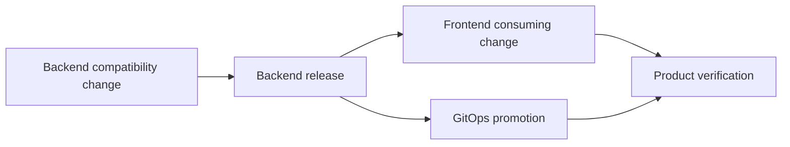

# PHarness Repo Mode operating model

Status: living design

Last decision round: 2026-08-24

Upstream authority:
[`product-vision-and-boundaries.md`](product-vision-and-boundaries.md)

## Purpose

Repo Mode is the first commercially useful PHarness product mode. It must
produce a verified source contribution from repository access alone, without
claiming runtime deployment or operational feedback that PHarness cannot
observe.

This document defines the settled operating boundary and keeps the remaining
onboarding and contract questions explicit. It is not an implementation
milestone.

## Supported outcome

A Repo Mode WorkItem applies these lifecycle stages:

```text
Discover -> Plan -> Implement -> Test -> Verify
```

After verification, PHarness may create one reviewed source pull request. The
WorkItem then enters an external wait while PHarness observes provider checks
and the manual merge. The WorkItem closes only after PHarness observes the
merge and records immutable merge provenance.

`Release` and `Observe` are unavailable in Repo Mode because no running Product
environment is connected. They must not be shown as failed, silently skipped,
or inferred from source merge. `Release` continues to mean promotion into an
Environment, not pull-request creation.

If provider checks are configured and declared as acceptance evidence,
PHarness observes them before describing the pull request as ready. Local
declared acceptance remains required even when provider checks are absent.

## Product and Repository scope

A Product may register multiple Repositories in Repo Mode. The initial mutation
boundary is intentionally narrower:

- One WorkItem may mutate exactly one Repository.
- The mutable Repository and source commit are immutable WorkItem inputs.
- Other explicitly registered Repositories may be pinned and used as read-only
  context.
- Every context Repository must record its resolved source revision.
- A source ChangeSet, writer authorization, pull request, and merge observation
  remain bound to the one mutable Repository.
- Coordinated multi-Repository mutation is deferred.

This permits useful Product-level understanding without introducing partial
multi-Repository delivery, incompatible merge ordering, or distributed
rollback into the first Repo Mode milestone.

## Repository onboarding PR

Repository onboarding should create value with low setup friction while still
leaving a reviewable, durable contract in the customer's source of truth.

The settled flow is:

1. An operator associates a Repository with a Product.
2. PHarness checks out an immutable source revision in a read-only discovery
   workspace.
3. Deterministic discovery produces durable facts. An AgentRun may then propose
   a Repository contract and Product or Service mappings while labeling its
   assumptions.
4. The operator reviews the proposed contract and its assumptions.
5. PHarness creates a dedicated onboarding pull request containing the reviewed
   `.pharness/repository.yaml` contract and bounded guidance.
6. The customer merges the pull request manually.
7. PHarness observes the merge, reloads the contract from the exact merge
   revision, validates it, and marks the Repository ready for coding WorkItems.

The discovery proposal may be stored centrally as onboarding state, but the
merged repository contract is the portable system of record for execution.
PHarness must not treat an unmerged draft as an active coding contract.

The canonical committed contract is `.pharness/repository.yaml`. Existing
`.pharness/project.yaml` files remain readable through a deprecated
compatibility alias during migration, but new onboarding pull requests create
or migrate to the canonical filename. A Repository cannot activate both files
with conflicting contents.

Product and Service mappings remain in the central PHarness product model
initially. The Repository contract contains portable execution facts, not a
second authoritative copy of the Product hierarchy. Amendments to executable
contract fields occur through a normal reviewed pull request and become active
only when PHarness observes and validates the merged revision.

Central annotations may supplement display-only metadata, but they cannot
override commands, dependency inputs, EnvironmentProfile selection, writable
paths, network policy, acceptance, or other executable contract fields.

Autonomous coding readiness requires an immutable dependency input, at least
one deterministic acceptance command, a valid EnvironmentProfile, and fresh
preparation evidence. Missing writer capability can block source delivery
without changing contract validity; capability availability and authorization
remain separate.

The complete state, authority, amendment, and readiness rules are recorded in
[`repository-onboarding-and-readiness.md`](repository-onboarding-and-readiness.md).

## Central-mode minimum safety baseline

Repo Mode optimizes for useful autonomy rather than hypothetical enterprise
deployment requirements. It still retains these practical safeguards:

- Immutable source revision and merge provenance.
- Disposable isolated workspaces.
- Reviewed Repository contract and writable roots.
- Declared acceptance commands and durable results.
- Explicit authorization for source mutation and pull-request creation.
- No raw credentials in model context.
- Bounded provider and network access.
- Durable tool, approval, evidence, and delivery audit records.
- Manual pull-request merge.

Customer-side satellites, air-gapped inference, sophisticated data residency,
and managed platform installation remain outside Repo Mode.

## Future multi-Repository delivery ordering

High-autonomy Product changes may eventually span frontend, backend, shared
libraries, infrastructure, and GitOps Repositories. Operators may not know the
safe merge and release order merely by reading individual pull requests.

Future multi-Repository work therefore needs an explicit **DeliveryPlan**. It
should be a dependency graph rather than an informal checklist:



The operator experience must eventually show:

- Required merge and promotion order.
- Nodes that may execute in parallel.
- Compatibility assumptions and evidence.
- Human and external boundaries.
- Current node, blocked nodes, and exact blockers.
- Partial-completion and rollback implications.
- Which agent or controller decision proposed each dependency.

This direction is settled, but its schema and validation rules are not. Repo
Mode must not implement multi-Repository writes before the DeliveryPlan,
partial-failure, and recovery contracts are designed.

## Open decisions before implementation planning

1. Define the first deterministic discovery inventory and its versioned output
   contract.
2. Define the exact Repository contract schema evolution and
   compatibility-alias removal policy.
3. Define pull-request check observation and what happens when checks change
   after PHarness reports readiness.
4. Map the settled onboarding states onto existing resources before adding a
   new persistence model.

Do not create a Repo Mode implementation milestone until these decisions and
the stage-outcome questions are resolved.
