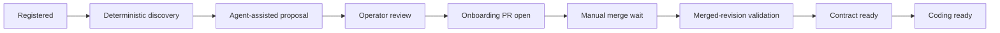

# PHarness repository onboarding and readiness

Status: living design

Last decision round: 2026-08-24

Upstream authorities:

- [`product-vision-and-boundaries.md`](product-vision-and-boundaries.md)
- [`product-model.md`](product-model.md)
- [`repo-mode-operating-model.md`](repo-mode-operating-model.md)

## Purpose

This document defines how a registered Repository becomes ready for Repo Mode
coding. It separates deterministic discovery, agent-assisted proposals, human
review, Git-owned execution configuration, and operational capability.

Repository onboarding is itself a reviewable delivery flow. PHarness may help
produce the contract, but it does not activate an inferred contract or a
central override that the Repository has never accepted.

## Onboarding lifecycle

The intended flow is:

1. An operator creates or selects a Product and registers a Repository at an
   immutable source revision.
2. PHarness performs deterministic, read-only discovery in an isolated
   workspace.
3. An AgentRun receives the discovery record and may propose Service bindings,
   a Repository contract, and bounded instructions. It must label assumptions
   and unsupported inferences.
4. The operator reviews the proposal, exact source revision, assumptions, and
   resulting file diff.
5. Explicit authorization allows PHarness to create a dedicated onboarding
   pull request. This authorization does not approve future coding changes.
6. A Repository owner reviews and merges the pull request manually.
7. PHarness observes the merge, reloads the contract from the exact merge
   revision, validates it, and records immutable onboarding provenance.
8. PHarness derives contract and coding readiness from current evidence.

An unmerged draft is never an active execution contract. A later source commit
cannot borrow readiness from a different contract revision without resolving
and validating the contract at the WorkItem's pinned source revision.

## Deterministic discovery and agent proposal

Deterministic discovery gathers facts without a model interpretation step,
including:

- Repository identity, default branch, and resolved commit.
- Existing PHarness contract or compatibility alias.
- Language and build-system indicators.
- Dependency manifests and lock candidates.
- Test, lint, build, and documentation conventions discoverable from source.
- Candidate source, test, and documentation roots.
- Existing automation and provider checks visible through configured
  read-only capabilities.

The discovery record is durable evidence. The AgentRun may use it to propose a
clean contract, describe conflicts, and suggest Product or Service mappings.
Agent proposals remain claims until the operator reviews them and deterministic
validation confirms the committed result.

Discovery has no writer credential and cannot modify the Repository. It uses
the exact registered revision and records every source it inspected.

## Canonical committed contract

The canonical contract is `.pharness/repository.yaml`.

`.pharness/project.yaml` remains readable as a deprecated compatibility alias
during migration. New onboarding pull requests create the canonical file, and
an onboarding pull request for a Repository using the alias migrates it. Two
conflicting active contracts are invalid.

The committed contract is the portable system of record for executable facts,
including:

- Environment profile selection.
- Immutable dependency input and lock identity.
- Named deterministic acceptance commands.
- Source, test, and documentation roots.
- Normalized writable paths.
- Network and dependency-preparation policy.
- Other bounded execution policy that affects what an AgentRun may do.

The Product model remains the initial authority for Product, Service,
Environment, and RepositoryBinding relationships. The onboarding proposal may
suggest those mappings, but the Repository contract does not become a second
Product database.

## Central annotations

PHarness may store central, non-executable annotations that improve navigation
without changing Repository behavior. Examples include an operator-facing
description, tags, ownership contacts, documentation links, and display
preferences.

Central annotations must not override or supply:

- Commands or dependency inputs.
- Environment profiles or runner images.
- Writable roots or source boundaries.
- Network, package, tool, or mutation policy.
- Acceptance requirements.

If a central field could alter model context, tool eligibility, produced code,
acceptance, or delivery behavior, it is executable configuration and belongs
in the reviewed Git contract.

## Readiness model

Readiness is derived state with evidence, not an operator-set boolean.

### Contract ready

A Repository is contract ready only when:

- PHarness observed the onboarding merge and recorded immutable merge
  provenance.
- The canonical contract resolves from the exact source revision.
- The contract passes schema, path, and policy validation.
- The selected EnvironmentProfile exists and is active.
- The dependency input is immutable and its identity is recorded.
- At least one deterministic acceptance command is declared.
- Writable and source roots are normalized, bounded, and internally
  consistent.

A Repository without an immutable dependency input or a reliable acceptance
command is not contract ready for autonomous coding. The onboarding pull
request may add or generate the missing input, but readiness begins only after
that reviewed change merges and validates.

### Coding ready

Coding readiness additionally requires fresh proof that PHarness can:

- Read and resolve the exact Repository revision.
- Prepare the declared dependency input using the selected runner profile.
- Provide the required executables and platform.
- Create an isolated workspace with the declared path and policy boundaries.
- Run the declared acceptance commands through the typed executor.

Source-writer and pull-request-observer availability should be shown beside
coding readiness because they determine whether PHarness can complete Repo
Mode delivery. They remain capability states, not contract facts. Missing
writer capability may block delivery without invalidating the committed
contract, and available capability never implies authorization.

### Readiness invalidation

Readiness is recomputed when the source revision, contract, dependency input,
EnvironmentProfile, relevant capability verification, or validation policy
changes. The UI shows the exact invalidating condition and last verified
revision rather than replacing readiness with a generic failure badge.

## Amendments

Executable contract changes follow the same source-control boundary:

1. PHarness or an operator proposes a contract diff against an immutable
   revision.
2. An operator reviews the executable effects and authorizes one amendment
   pull request.
3. A Repository owner merges manually.
4. PHarness observes the merge and validates the new exact revision.
5. New WorkItems may use the amended contract; existing pinned WorkItems retain
   their original snapshot unless explicitly replanned within their identity
   boundary.

No emergency central override silently changes executable contract behavior.
A capability may be disabled centrally as a safety action, but that does not
rewrite the Repository's declared contract.

## Operator evidence

The Repository view should expose:

- Registered and discovered revisions.
- Deterministic discovery evidence and agent-proposal assumptions.
- Onboarding or amendment pull request and observed merge.
- Active contract path, revision, schema version, and content hash.
- Dependency-lock and EnvironmentProfile identity.
- Declared acceptance commands and writable roots.
- Contract-readiness and coding-readiness checks with exact blockers.
- Source reader, writer, and observer capability state, separately from trust
  policy and authorization.

## Open decisions before implementation planning

1. Define the first deterministic discovery inventory and its versioned output
   contract.
2. Define the exact contract schema evolution and compatibility-alias removal
   policy.
3. Define provider-check observation, freshness, and invalidation when checks
   change after PHarness reports a pull request ready.
4. Map readiness onto existing environment preparation and capability
   preflight records without creating duplicate sources of truth.

Do not implement onboarding as an AgentRun with writer access. Deterministic
discovery, proposal, operator review, PR authorization, merge observation, and
validation are distinct boundaries.
