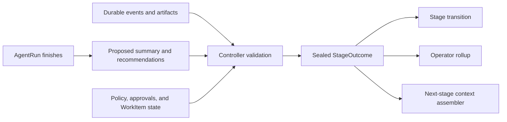

# PHarness stage outcomes and evidence handoffs

Status: living design

Last decision round: 2026-09-04

Upstream authority:
[`product-vision-and-boundaries.md`](product-vision-and-boundaries.md)

## Hosted workflow direction

The [ASTRA program](../programs/autonomous-sdlc/ASTRA-00-PROGRAM.md) extends the existing
outcome machinery across discover, plan, implement, test, verify, source_delivery,
release, and observe. Build, staging, and production evidence remain distinguishable
within release. New hosted work cannot complete at source merge. Legacy source-only
inapplicable tails and completed records retain their original meaning.

Normalized caveats must retain submitted risks/contradictions. Agent claims are not
verified facts, and unresolved contradictions cannot be sealed as unconditional success.
Missing runtime telemetry is inconclusive. Restored service after rollback does not mean
the requested change succeeded. These are M03/M05/M08/M09 requirements, not a claim that
all current normalization and release paths already satisfy them.

## Purpose

PHarness already persists detailed events, tool results, artifacts, approvals,
provenance, tests, delivery evidence, and release verification. The missing
product contract is how those records become a trustworthy stage conclusion,
an understandable operator rollup, and bounded context for the next AgentRun.

Raw history is evidence, not a handoff. An earlier agent's summary is a claim,
not automatically a fact. The deterministic controller must adjudicate and
seal the effective stage outcome before the WorkItem advances.

## WorkItem is the correlation root

All execution and evidence for one engineering intent must be navigable from
its WorkItem:

```text
WorkItem
  -> intent and current scope
  -> lifecycle stages
    -> stage executions
      -> AgentRuns
      -> tool executions
      -> evidence and approvals
      -> sealed StageOutcome
  -> source and delivery resources
  -> current effective state
  -> prior history
```

Product, Repository, AgentRun, approval, and Release views may provide
cross-WorkItem lenses, but they must retain the WorkItem correlation and must
not mix unrelated records into one apparent execution.

## WorkItem and stage-execution identity

A WorkItem represents one bounded engineering intent. A replan remains within
the same WorkItem when the desired outcome, mutable Repository, and required
acceptance boundary remain materially the same. A materially changed outcome,
Repository, delivery target, or acceptance boundary creates a new linked
WorkItem rather than rewriting the original intent.

Execution identity is equally explicit:

- Provider transport retries and recoverable tool retries remain within the
  same StageExecution.
- Resuming after an approval wait or budget extension remains within the same
  StageExecution.
- A full replan or deliberate repeat of a lifecycle stage creates a new
  StageExecution.
- Terminal outcomes are immutable. The controller may select a later outcome
  as effective without altering or hiding the earlier one.
- Prior executions and outcomes appear under History with their exact stop
  reasons and relationships.

Typed WorkItem relationships such as `supersedes`, `follows_up`, and
`discovered_from` retain continuity when an intent change requires new work.

## StageOutcome contract direction

A StageOutcome is an immutable, controller-sealed conclusion for one stage
execution. It should contain:

- WorkItem, stage, and stage-execution identity.
- Objective and terminal status.
- Immutable inputs and Product/Repository model snapshot references.
- Verified facts with evidence references, provenance, scope, and freshness.
- Agent claims that could not be independently verified.
- Decisions made and authorizations consumed.
- Outputs, changed resources, and acceptance results.
- Unresolved risks, contradictions, and unavailable capabilities.
- Recommendations clearly separated from facts and decisions.
- Exact stop reason.
- A content and state hash binding the outcome to its inputs and WorkItem state.

Sealed outcomes are never rewritten. A retry, resume, or replan creates new
execution history and may produce a later effective outcome; the earlier
outcome remains inspectable.

## Terminal status and effective outcome

StageOutcome uses a small terminal status set:

| Status | Meaning |
| --- | --- |
| `succeeded` | The applicable stage completed and its required outputs and acceptance evidence were verified |
| `failed` | The stage executed but reached a terminal, unsatisfied result |
| `blocked` | The stage could not complete because a required input, capability, policy decision, authorization, or external condition remained unsatisfied |
| `cancelled` | An authorized actor or controller rule deliberately terminated the execution before completion |
| `inapplicable` | The WorkItem mode or scope does not include this lifecycle stage |

An active wait, recoverable retry, approval pause, or budget-extension pause is
not a terminal status. The StageExecution remains current until it resumes or
the controller seals an appropriate terminal outcome.

`stale` is an evidence-freshness property, not a terminal status. A previously
succeeded outcome may become insufficient for a later action when its evidence
is stale without rewriting what that StageExecution established at the time.

`superseded` is a relationship, not a terminal status. A later StageOutcome may
become the effective outcome for a stage after replan or deliberate repeat.
The WorkItem stores the controller-selected effective pointer while preserving
all outcomes and why the selection changed.

An inapplicable stage may be sealed by the controller without dispatching an
AgentRun. Unavailable capability does not mean inapplicable when the stage is
required; it produces a wait or, if the execution terminates, a blocked
outcome.

## Controller sealing flow



The controller owns:

1. Selecting records within the exact WorkItem and stage-execution scope.
2. Verifying objective claims against typed evidence and acceptance rules.
3. Separating verified fact, unverified claim, decision, and recommendation.
4. Recording contradictions and stale evidence instead of smoothing them over.
5. Binding the result to current state and rejecting stale sealing attempts.
6. Determining whether the lifecycle may advance.

An agent may propose a summary, but it cannot seal its own success or advance
the lifecycle directly.

## Initial typed evidence validators

Repo Mode begins with controller-owned validators for:

- Pinned source revision and resolved checkout identity.
- Repository contract path, API version, content hash, and validation result.
- EnvironmentSnapshot identity and preparation result.
- Changed-path inventory and full diff content hash.
- Exact declared acceptance command, execution identity, exit result, and
  captured output reference.
- Source pull-request identity and exact head SHA.
- Required provider-check set, result, freshness, and bound head SHA.
- Observed merge identity, merge SHA, source head, and provider provenance.

A validator may establish only the claim covered by its typed input and scope.
An AgentRun's interpretation of design quality, maintainability, completeness,
or business intent remains an agent claim unless a later validator explicitly
defines and verifies it.

Missing, contradictory, or stale evidence is recorded honestly. The controller
does not convert the absence of a failing record into success.

## Context for the next AgentRun

The next AgentRun receives a bounded context pack rather than every prior
transcript. The initial deterministic selection includes:

- Current WorkItem intent, scope, and acceptance criteria.
- Pinned Product, Service, RepositoryBinding, Repository contract, and
  applicable Environment snapshot.
- Effective upstream StageOutcomes.
- Remaining budgets, policies, grants, and unavailable capabilities.
- Exact evidence and artifact references needed for the next objective.
- Explicit contradictions, unresolved risks, and operator decisions.
- Applicable operator annotations.

The context pack records which outcome and evidence versions it used. Context
selection must be deterministic enough to reproduce and audit, while remaining
bounded enough to avoid exhausting model context with raw history.

Raw transcripts and undifferentiated event streams are excluded by default.
An AgentRun retrieves deeper evidence through typed tools on demand. Every
retrieval records the requester, scope, evidence version, and returned content
hash so later analysis can reproduce what the agent saw.

Token allocation prioritizes current intent and acceptance, applicable policy,
effective upstream outcomes, contradictions, unresolved risks, and the exact
evidence needed for the stage. Compaction may shorten presentation but cannot
silently remove a contradiction, failed acceptance result, operator decision,
or provenance binding.

## Operator correction and annotation

An operator correction is an append-only, attributed Annotation bound to an
exact WorkItem, StageExecution, StageOutcome, or evidence record. It contains
the actor, reason, timestamp, statement, and referenced evidence.

An Annotation never rewrites a sealed StageOutcome or external observation.
The controller may decide that it:

- Adds context without changing effective state.
- Makes evidence stale or contradictory for a future action.
- Requires a new StageExecution or WorkItem replan.
- Supplies input for a newly sealed outcome that supersedes the effective
  pointer.

The original outcome, annotation, controller decision, and any later outcome
remain linked and inspectable.

## Initial control model

The first control model remains deliberately simple:

- The deterministic controller owns state, policy, evidence sealing, and stage
  transitions.
- An ephemeral Planner AgentRun may propose a WorkPlan or replan.
- Stage-specific AgentProfiles perform bounded work.
- The controller assembles context and dispatches the next AgentRun.
- No persistent Product-level control agent is required for Repo Mode.

A persistent Product Steward becomes meaningful later, when Connected Mode can
feed runtime and Observe evidence back into task generation. Even then, it may
propose WorkItems and coordination; it does not become the source of truth for
state or policy.

## Operator rollups and history separation

The default WorkItem experience should answer these questions without exposing
an undifferentiated event stream:

- What intent is PHarness pursuing?
- What is the current stage and exact boundary?
- What did each completed stage establish?
- Which facts are verified and which remain claims or risks?
- What changed, what was tested, and what evidence supports the result?
- What is waiting on a human or external system?
- What happened in previous attempts, and why are they no longer current?

The UI should present:

1. **Intent and scope** as the WorkItem header.
2. **Current execution** as the primary operational surface.
3. **Stage rollups** from sealed StageOutcomes.
4. **Current evidence and delivery state** attached to the owning stage.
5. **History** as a separate chronological view of prior executions and
   superseded outcomes.
6. **Raw events and artifacts** as drill-down evidence, not the default mental
   model.

Portfolio and Product views aggregate WorkItem rollups. They must not merge
events from several WorkItems into a synthetic execution or place old and
current AgentRuns beside each other without status and ownership context.

## Implementation planning requirements

1. Map the proposed concepts to existing PHarness events and resources before
   adding a new database entity.
2. Define serialized validator and context-pack schemas during the first
   implementation milestone.

Do not implement a generic multi-agent message bus. StageOutcome and evidence
retrieval are the first handoff contracts; orchestration builds on them later.
