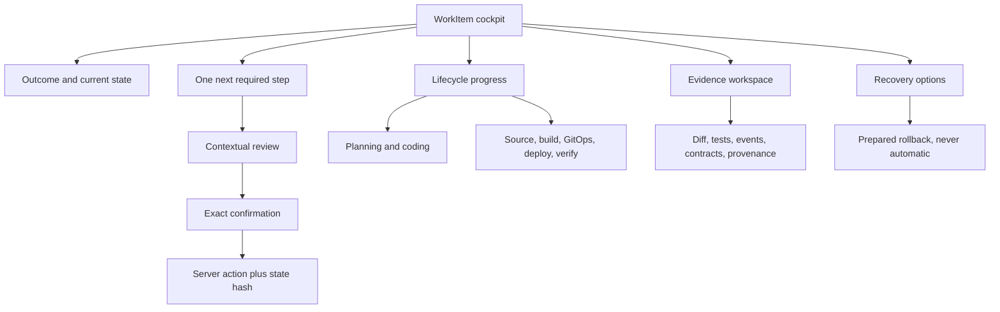

# PHarness Operator Cockpit Redesign Milestone

## Outcome

Make the WorkItem screen the one place an operator can understand and advance
a supervised SDLC run. The console must answer, in order:

1. Did the WorkItem finish, fail, wait, or need a decision?
2. What is the single next lifecycle boundary?
3. What evidence must be reviewed before that boundary can advance?
4. What exact external effect will occur?
5. What happened earlier, and what remains later?

The redesign is presentation-only unless a missing server read model makes an
honest UI impossible. It does not weaken state hashes, approval gates,
attempt-scoped grants, manual merges, production windows, or rollback policy.

## Current failure modes

- A completed WorkItem can select a prepared rollback action as its primary
  next step. Rollback is a contingency, not normal forward progress.
- The global scope bar and audit search occupy the most valuable space on a
  focused WorkItem screen even though they do not control that WorkItem.
- Current boundary, controller blockers, authorization checks, action rail,
  approval queues, and delivery evidence repeat similar state without a clear
  hierarchy.
- Future or emergency actions appear beside the current forward action. The
  operator can click a technically valid but contextually wrong control.
- Long vertical pages require operators to leave the WorkItem or hunt through
  separate approval pages to understand one lifecycle transition.
- Terminal controller preview text is styled as a blocker, even when the
  WorkItem completed successfully.
- Historical delivery evidence can disagree with the WorkItem terminal status
  without an explicit evidence-consistency warning.

## Information architecture

## Interaction rules

- A terminal successful WorkItem has no forward primary action.
- Rollback actions always live in a visually separate recovery area. They
  become prominent only after failure or explicit recovery intent.
- Only one ready forward action may be primary. Other ready actions are
  contextual or recovery actions and require an explicit review surface.
- The primary button uses the server action name. The confirmation repeats the
  exact target, effect, approval requirements, actor, reason, and state hash.
- Future gates remain visible as lifecycle context but cannot be batch-approved
  from the WorkItem.
- Tool approvals remain distinct from lifecycle approval gates.
- Navigation, refresh, section changes, and evidence inspection are read-only.
- A disagreement between terminal WorkItem state and delivery evidence is
  named as an evidence-consistency issue, never silently normalized.

## Delivery slices

### U1 - Cockpit hierarchy and terminal truth

- Replace the flat WorkItem facts wall with a mission header and compact trust
  facts.
- Replace the generic reconcile panel with an outcome-aware action center.
- Suppress terminal pseudo-blockers on successful completed WorkItems.
- Move rollback out of the primary action selector into Recovery options.
- Collapse the complete action rail under an advanced lifecycle disclosure.
- Remove global scope and audit-search controls from focused WorkItem detail.
- Add characterization tests for completed, blocked, active, review, and
  rollback states on desktop and mobile.

### U2 - Contextual lifecycle reviews

- Render WorkPlan, workspace grant, ChangeSet, PipelineIntent,
  DeploymentIntent, Release, and rollback review in one consistent drawer.
- Show the evidence required for the current decision beside the action.
- Link blockers to the exact corrective review rather than a generic queue.
- Keep approve/reject decisions resource-scoped and state-hashed.

### U3 - Active attempt workspace

- Make Attempt the default section while preparation or coding is active.
- Combine environment snapshot, turns/tokens/time, tool stream, approvals,
  changed paths, diff, and acceptance results into one run workspace.
- Keep budget extension in place without losing the active run context.

### U4 - Delivery and release workspace

- Render source, build, GitOps, deploy, and verify as a single stage-aware
  evidence timeline.
- Put manual merge waits, Tekton results, Argo state, health verification, and
  digest equality in their owning stages.
- Keep production window and rollback baseline continuously visible during
  deployment.

### U5 - Navigation and triage

- Reduce primary navigation to Operate, Govern, Investigate, and Platform
  groups without adding a second sidebar.
- Make Triage an exception inbox; WorkItem-specific reviews deep-link into the
  cockpit rather than teaching operators to mutate from multiple pages.
- Remove ambiguous phrases such as "approve safe actions" from mutation
  controls.

### U6 - Release characterization

- Preserve the completed yfinance WorkItem and its durable events as the
  redesign characterization fixture.
- Run desktop/mobile snapshots for empty, blocked, active, approval,
  production confirmation, completed, and rollback-ready states.
- Run Vitest, full Playwright, production build, and the existing Rust gates.
- Build immutable UI/runtime artifacts from one merged SHA, release through
  GitOps, and verify API/UI revision and digest alignment.

## Acceptance criteria for U1

- A completed WorkItem says "WorkItem complete" and does not present rollback
  as forward progress.
- A ready rollback remains inspectable and executable only from Recovery
  options with the existing exact confirmation.
- A non-terminal WorkItem presents one server-derived next action and its
  blockers in one card.
- Successful terminal preview text is not rendered as a failure blocker.
- Focused WorkItem detail contains no unrelated global scope selectors or
  audit search.
- Existing state-hash and explicit-confirmation tests continue to pass.
- Desktop and phone-width snapshots cover the completed and recovery states.
