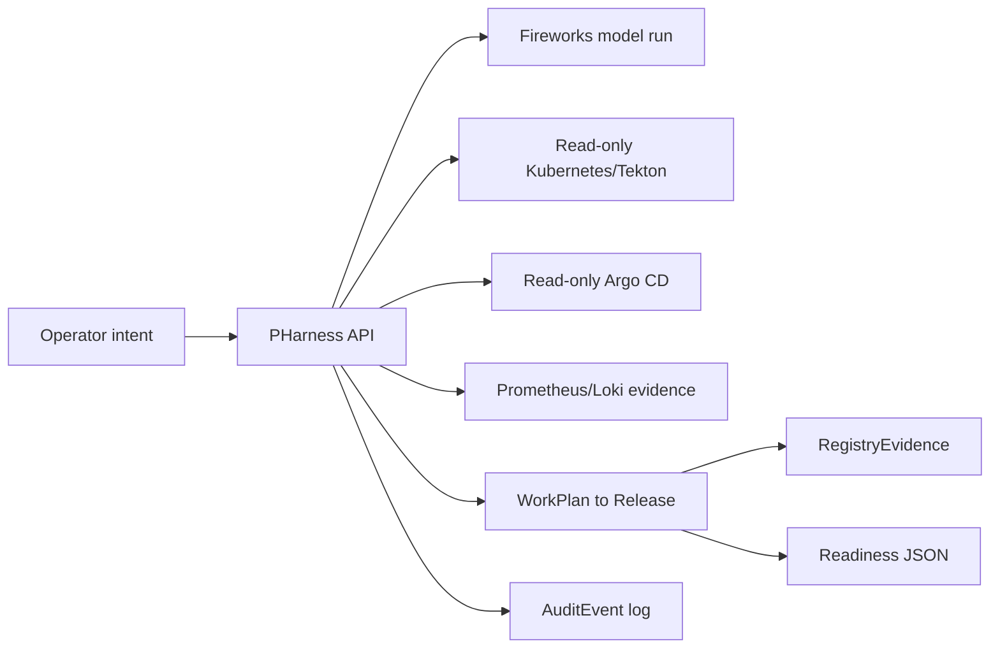

# PHarness Full Demo Script

Audience goal: show the full local-to-cluster control-plane path with Fireworks model interaction, live read-only Kubernetes evidence, Prometheus/Loki port-forwards, Argo evidence, Release observability, registry evidence, policy denial, audit, readiness, and approval invalidation.

This is the higher-risk version of the demo. Run it once before presenting. If anything is flaky, fall back to `planning/pharness-demo-script.md`.

Core message:

> PHarness is an agentic SDLC control plane. The model is one worker behind a durable API. The important part is the structured state: typed capabilities, evidence, policy, approvals, readiness, and audit.

## Demo Shape



## Terminal 1: Preflight

Run from the PHarness repo root.

```bash
source ~/.zshrc
test -n "$FIREWORKS_API_KEY"
kubectl config current-context
kubectl get ns monitoring argocd
kubectl -n monitoring get svc prometheus-server loki
kubectl -n argocd get applications.argoproj.io \
  -o custom-columns=NAME:.metadata.name,HEALTH:.status.health.status,SYNC:.status.sync.status
```

Narration:

> The full demo depends on three live systems: Fireworks for the model worker, Kubernetes for read-only delivery evidence, and the LGTM stack for runtime evidence.

Pick one Argo Application from the output. If you are unsure, use `ghost` only if it exists.

```bash
export PHARNESS_E2E_ARGO_APP=ghost
```

If `ghost` is not present, replace it:

```bash
export PHARNESS_E2E_ARGO_APP=<argo-application-name>
```

## Terminal 2: Prometheus Port-Forward

Leave this running.

```bash
kubectl -n monitoring port-forward svc/prometheus-server 19090:80
```

Expected:

- The command stays attached.
- You should see forwarding lines for `127.0.0.1:19090`.

## Terminal 3: Loki Port-Forward

Leave this running.

```bash
kubectl -n monitoring port-forward svc/loki 13100:3100
```

Expected:

- The command stays attached.
- You should see forwarding lines for `127.0.0.1:13100`.

## Terminal 4: Start The API

Leave this running. This is the terminal the room can watch for live API/request logs.

```bash
source ~/.zshrc
test -n "$FIREWORKS_API_KEY"
rm -f target/pharness-full-demo.sqlite
PHARNESS_BIND=127.0.0.1:4777 \
PHARNESS_DB_PATH=target/pharness-full-demo.sqlite \
PHARNESS_FIREWORKS_MODEL=accounts/fireworks/models/kimi-k2p5 \
PHARNESS_PROMETHEUS_URL=http://127.0.0.1:19090 \
PHARNESS_LOKI_URL=http://127.0.0.1:13100 \
PHARNESS_REGISTRY_ALIASES=docker-registry.registry.svc.cluster.local:5000=registry.lucas.engineering \
RUST_LOG=pharness_api=info,tower_http=info \
cargo run -p pharness-api
```

Narration:

> The API is the control plane. The smoke runner will call this service from another terminal, so we can watch the live request/action stream here.

Expected:

- The API starts on `127.0.0.1:4777`.
- Leave this terminal open.

## Terminal 5: Full E2E Smoke

Run from the PHarness repo root.

```bash
source ~/.zshrc
test -n "$FIREWORKS_API_KEY"
export PHARNESS_API_URL=http://127.0.0.1:4777
export PHARNESS_E2E_ARGO_APP=ghost
export PHARNESS_PROMETHEUS_URL=http://127.0.0.1:19090
export PHARNESS_LOKI_URL=http://127.0.0.1:13100
export PHARNESS_E2E_LOKI_QUERY='{namespace="argocd"}'
export PHARNESS_E2E_LOKI_SINCE_SECONDS=900
export PHARNESS_E2E_LOKI_LIMIT=25
export PHARNESS_E2E_MODEL_TIMEOUT_MS=300000
export PHARNESS_FIREWORKS_MODEL=accounts/fireworks/models/kimi-k2p5
export PHARNESS_REGISTRY_ALIASES=docker-registry.registry.svc.cluster.local:5000=registry.lucas.engineering
cargo run -q -p pharness-cli -- config \
  | tee target/pharness-full-demo-config.json \
  | jq '{worker: .worker, cluster: .cluster, policy: .policy.mode}'
jq -e '.worker.enabled == true and .worker.model == "accounts/fireworks/models/kimi-k2p5"' \
  target/pharness-full-demo-config.json
scripts/pharness-e2e-smoke.sh --external-api --cluster --model
```

If you chose a different Argo Application, set that value instead of `ghost`.

Narration while it runs:

> The API is already running in the other terminal with a fresh SQLite database. This runner drives the same API and CLI surfaces a worker would use. The cluster checks are read-only. Secret reads are denied before execution. The model run is Fireworks-backed, but it is still just one event-producing worker behind the control plane.

If the config assertion fails, restart Terminal 4 after sourcing `~/.zshrc`. The API reads `FIREWORKS_API_KEY` and `PHARNESS_FIREWORKS_MODEL` only at startup.

Expected final manifest:

- `status` is `passed`.
- `model_run` is `completed`.
- `cluster_run` is `completed`.
- `release_observability` is `attention_required`.
- `release_observability_remediation` is `created`.

Show the manifest:

```bash
jq . target/e2e-smoke/latest/manifest.json
```

## Show The Model Run

```bash
jq '{wait_status, run_status: .run.status, result: .run.result}' \
  target/e2e-smoke/latest/model-run.json
```

Then show event flow:

```bash
jq '.events[] | {seq, type, payload}' \
  target/e2e-smoke/latest/model-run-events.json
```

Narration:

> The model interaction is observable as durable events: request started, response finished, action proposed, policy evaluated, tool started, tool finished, and run finished.

## Show Policy Denial

```bash
jq '{status, executed, decision: .decision.decision, summary: .decision.summary}' \
  target/e2e-smoke/latest/secret-denial.json
```

Show the audit event:

```bash
jq '.events[] | {kind, actor, resource_kind, resource_id, executed: .payload.executed}' \
  target/e2e-smoke/latest/audit-secret-denial.json
```

Narration:

> PHarness is not trusting installed tools blindly. A secret-shaped Kubernetes read is denied before execution and recorded as audit.

## Show Tekton Evidence

```bash
jq '{
  status,
  artifact_id,
  observation_id,
  pipeline_run: .result.content.analysis.pipeline_run,
  summary: .result.content.analysis.summary
}' target/e2e-smoke/latest/cluster-tekton-analysis.json
```

Narration:

> A read-only Tekton capability analyzes one concrete PipelineRun, persists the compact analysis as an artifact, and indexes it as an Observation.

Show the persisted artifact:

```bash
jq '{id, kind, label, content: .content_json.analysis.summary}' \
  target/e2e-smoke/latest/cluster-tekton-analysis-artifact.json
```

Show the persisted observation:

```bash
jq '{id, source, kind, subject, resource_namespace, resource_kind, resource_name, artifact_id}' \
  target/e2e-smoke/latest/cluster-tekton-analysis-observation.json
```

## Show Argo Evidence

```bash
jq '.deployment_intent.intent_json.deployment_evidence' \
  target/e2e-smoke/latest/cluster-deployment-attach-evidence.json
```

Narration:

> Argo Application evidence is attached to the approved DeploymentIntent. Release creation inherits this as deployment evidence, but evidence status remains separate from lifecycle status.

If the Argo attach file is missing, the app env var was not set or the app read failed. Do not improvise; skip this section.

## Show Prometheus And Loki Evidence

Prometheus inventory:

```bash
jq '{
  status,
  executed,
  observation_id,
  targets: .result.content.inventory.targets.active_count,
  unhealthy_targets: .result.content.inventory.targets.unhealthy_count,
  rules: .result.content.inventory.rules.rule_count,
  problem_rules: .result.content.inventory.rules.problem_rule_count,
  alerts: .result.content.inventory.alerts.alert_count
}' target/e2e-smoke/latest/cluster-prometheus-inventory.json
```

Loki log summary:

```bash
jq '{
  status,
  executed,
  observation_id,
  streams: .result.content.response.data.stream_count,
  entries: .result.content.response.data.entry_count
}' target/e2e-smoke/latest/cluster-loki-log-summary.json
```

Release observability attachment:

```bash
jq '.release.release_json.observability_evidence' \
  target/e2e-smoke/latest/release-attach-observability.json

jq '{
  incident: .incident,
  remediation_plan: .remediation_plan
}' target/e2e-smoke/latest/release-attach-observability-alert.json

jq '{count, gates: [.approval_gates[] | {kind: .gate_kind, status}]}' \
  target/e2e-smoke/latest/release-observability-approval-gates.json
```

Narration:

> Runtime confidence is Release evidence. PHarness can attach Prometheus or Loki observations to the Release without making any production mutation. Attention-required evidence becomes reviewable work: a candidate Incident, a draft RemediationPlan, and explicit approval gates.

If Prometheus or Loki files are missing:

```bash
ls target/e2e-smoke/latest/*prometheus* target/e2e-smoke/latest/*loki*
```

Then say:

> The control-plane path still works, but the live LGTM endpoint was unavailable. The API details are visible in Terminal 4. That is exactly why evidence status is explicit.

## Show The SDLC Chain

```bash
jq '{
  ready: .readiness.ready,
  blockers: [.readiness.blockers[].code],
  warnings: [.readiness.warnings[].code],
  work_plan: .work_plan.status,
  change_set: .change_set.status,
  pipeline_intent: .pipeline_intent.status,
  deployment_intent: .deployment_intent.status,
  release: .release.status,
  registry_evidence: .registry_evidence.status,
  incidents: [.incidents[] | {id, status, severity}],
  remediation_plans: [.remediation_plans[] | {id, status, risk_level}],
  approval_gates: [.approval_gates[] | {kind: .gate_kind, status}]
}' target/e2e-smoke/latest/change-set-flow.json
```

Narration:

> This is the product. PHarness can answer whether bounded autonomous execution is allowed, which evidence is still cautionary, and which review artifacts are active from one machine-facing endpoint.

Expected:

- `ready` is `true`.
- `blockers` is empty.
- Registry verification warnings may still be present.
- Runtime observability should not be missing.
- Release observability remediation artifacts should be present when attention-required evidence exists.

## Show Registry Evidence

```bash
jq '{
  status: .registry_evidence.status,
  source: .registry_evidence.source,
  verification_status: .registry_evidence.verification_status,
  image_ref: .registry_evidence.image_ref,
  evidence_json: .registry_evidence.evidence_json
}' target/e2e-smoke/latest/registry-evidence-create.json
```

Narration:

> RegistryEvidence is non-mutating in this demo. It records image identity/probe evidence and keeps supply-chain proof separate from operator lifecycle verification.

Then show lifecycle verification:

```bash
jq '{status: .registry_evidence.status, verification_status: .registry_evidence.verification_status}' \
  target/e2e-smoke/latest/registry-evidence-verify.json
```

## Show Approval Invalidation

```bash
jq '{
  change_set_status: .change_set.status,
  pipeline_intent_status: .pipeline_intent.status,
  deployment_intent_status: .deployment_intent.status,
  release_status: .release.status,
  registry_evidence_status: .registry_evidence.status,
  blockers: [.blockers[].code],
  warnings: [.warnings[].code]
}' target/e2e-smoke/latest/readiness-after-revision.json
```

Narration:

> Trusted envelopes solve approval fatigue, but stale trust is dangerous. A material ChangeSet revision invalidates downstream intent and evidence.

Show stale grant audit:

```bash
jq '.events[] | select(.kind == "permission_grant.stale") | {
  kind,
  actor,
  resource_id,
  reason: .payload.reason
}' target/e2e-smoke/latest/audit-stale-envelope.json
```

## Show API Logs

Narration:

> The live logs are in Terminal 4 because the smoke runner is using an external API. This runs as an API service. The UI can come later; the runtime is already observable and machine-facing.

## Cleanup

Stop Terminal 2, Terminal 3, and Terminal 4 with `Ctrl-C`.

No production state should have been mutated. The API used a fresh local SQLite database at `target/pharness-full-demo.sqlite`.

## Backup Path

If Fireworks fails:

```bash
PHARNESS_E2E_ARGO_APP="$PHARNESS_E2E_ARGO_APP" \
PHARNESS_API_URL=http://127.0.0.1:4777 \
PHARNESS_PROMETHEUS_URL=http://127.0.0.1:19090 \
PHARNESS_LOKI_URL=http://127.0.0.1:13100 \
PHARNESS_E2E_LOKI_QUERY='{namespace="argocd"}' \
PHARNESS_REGISTRY_ALIASES=docker-registry.registry.svc.cluster.local:5000=registry.lucas.engineering \
scripts/pharness-e2e-smoke.sh --external-api --cluster --no-model
```

If the cluster or port-forwards fail:

```bash
PHARNESS_API_URL=http://127.0.0.1:4777 scripts/pharness-e2e-smoke.sh --external-api --no-model
```

Say:

> The degraded path still proves the control-plane contract. The live systems only enrich evidence.

## Close

Use this close:

> PHarness is not trying to be a plugin marketplace or a chat shell. It is the control plane that lets agents work continuously inside bounded SDLC state, with evidence, policy, approvals, readiness, and audit.

## Decisions

- This full demo runs the API in its own terminal and drives the actual smoke runner with `--external-api --cluster --model`, so the presentation proves one integrated path while showing live API logs.
- Port-forward Prometheus and Loki locally to keep V1 local-first and non-mutating.
- Keep all cluster access read-only in the demo.
- Use `jq` against generated artifacts instead of replaying every API request live.
- Treat Fireworks and LGTM failures as degradable evidence-source failures, not control-plane failures.

## Backlog

- Add a presenter wrapper script that starts port-forwards, waits for readiness, runs full smoke, and prints the key summaries.
- Add a generated HTML report from `target/e2e-smoke/latest` for presentation mode.
- Add stable cluster service discovery for Prometheus and Loki instead of hard-coding service names in docs.
