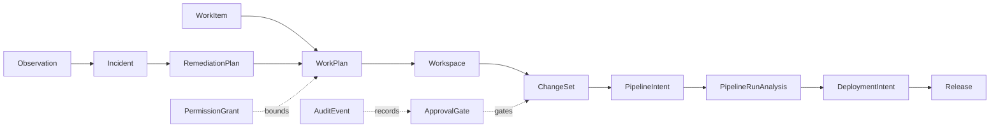
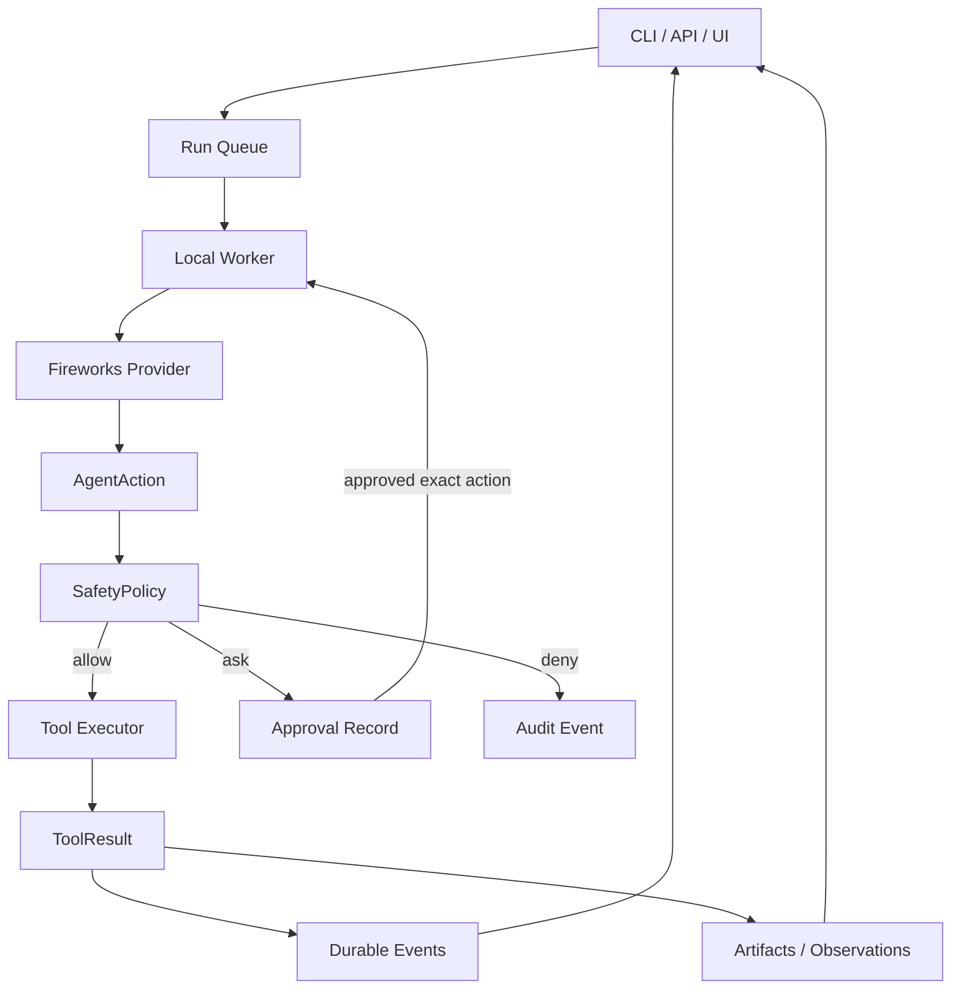

<!-- _class: lead -->

# PHarness

## An agent harness as an SDLC control plane

Local-first today. Cluster-native by design.

Casual AI dev meetup talk

---

# The Claim

The hard part is not making a model call a tool.

The hard part is letting it do useful work while preserving:

- operator intent
- policy boundaries
- auditability
- replayability
- evidence
- rollback context

That is what pharness is trying to be.

---

# Why Build This?

Agent coding tools are already useful.

But most of them still blur three different problems:

- chat with a model
- automate local developer tasks
- safely operate production-facing delivery systems

Those are different trust domains.

PHarness starts with local coding because it is the smallest useful proving ground, but the real target is autonomous delivery inside a governed SDLC.

---

# Philosophy

PHarness is opinionated in a few places:

- small surface area beats plugin sprawl
- typed actions beat opaque shell commands
- policy decisions belong in the runtime, not the prompt
- every important action should become durable evidence
- autonomy should be bounded by explicit envelopes
- chat is secondary to runs, approvals, artifacts, and audit

If the system cannot explain what happened, it should not be allowed to do much.

---

# What PHarness Is

A lightweight Rust agent harness for local coding workflows that is designed to grow into a Kubernetes-native autonomous delivery runtime.

Current core:

- Fireworks-first model provider
- one-action-per-turn agent loop
- local file, shell, git, and patch tools
- conservative safety policy
- approvals and approval resume
- durable SQLite sessions, events, artifacts, diffs, observations, incidents, plans, gates, and audit events
- CLI and machine-facing HTTP API

---

# What It Is Not

PHarness is deliberately not:

- a plugin marketplace
- a general integration ecosystem
- an MCP-first runtime
- a chat UI with tools bolted on
- a hidden permission bypass
- an autonomous production deployer

The bias is control-plane first: explicit resources, explicit capability boundaries, explicit evidence.

---

# Current State

PHarness has crossed the "real control-plane slice" line.

Implemented surfaces include:

- `POST /api/runs` with worker execution
- SSE run event streaming and replay
- Fireworks native tool calling as the default protocol
- approval queues and exact action resume
- run-scoped diffs and artifacts
- typed read-only Kubernetes, Argo, Tekton, Prometheus, and Loki capabilities
- durable observations, incident candidates, remediation plans, work plans, change sets, approval gates, permission grants, and audit events

This is still early, but it is no longer just a plan.

---

# Local-First, Cluster-Native

V1 runs locally from a project root.

The code still carries the nouns needed later:

- `ExecutionTarget`: where work runs
- `ResourceRef`: what the action touched
- `ArtifactRef`: what evidence was produced
- `CapabilityKind`: what class of action policy evaluated
- `RunScope`: namespace, repo, branch, work plan, change set, production impact

The point is to avoid painting V1 into a corner.

---

# What The Operator Sees

The UI prototype treats runs, evidence, policy, approvals, and audit as first-class surfaces.

Chat is not the center of gravity.

---

# The SDLC Shape

V1 stores these as database-backed workflow resources. The longer-term direction is Kubernetes CRDs.

---

# Runtime Architecture

The model proposes. The runtime decides. The store remembers.

---

# One Action Per Turn

PHarness intentionally keeps the agent loop narrow:

1. send context and tool schemas to the model
2. receive exactly one proposed action
3. validate action shape
4. evaluate policy
5. execute, pause, deny, or finish
6. append result and continue

Parallel tool calls are disabled in the Fireworks request path. If a model still returns multiple calls, pharness keeps one and preserves the one-action loop.

That constraint makes policy, replay, and approval resume tractable.

---

# Policy Is A Runtime Contract

Default posture:

- read-only actions allowed
- file writes ask
- destructive or network shell commands ask
- privileged and secret-accessing commands denied
- typed cluster reads allowed unless they look secret-shaped
- grants cannot override denials

Policy mode is persisted on the run execution target and reused when a paused run resumes.

That matters. A resumed run should not accidentally inherit today's config drift.

---

# Approvals Are Two Different Things

Tool approval:

- "May this paused run execute this exact action?"
- approve or deny
- resumes or fails the run
- tied to reviewed action JSON and preview diff

Approval gate:

- "Has this governance checkpoint been satisfied?"
- satisfy, waive, or reject
- does not execute work
- belongs to remediation, work planning, change set, or release review

Mixing these is a design bug. The UI keeps them visibly separate.

---

# Typed Capabilities

PHarness does not want production delivery to become a pile of shell wrappers.

Current typed read-only capabilities include:

- `kubernetes_get`
- `argo_get_app`
- `tekton_get_pipeline_runs`
- `tekton_get_task_runs`
- `tekton_analyze_pipeline_run`
- `prometheus_query`
- `prometheus_inventory`
- `loki_log_summary`

The future mutating versions should be separate approved capability classes, not hidden inside `run_shell`.

---

# Tekton Analysis Example

`tekton_analyze_pipeline_run` reads one PipelineRun plus related TaskRuns and correlates useful SDLC evidence:

- pipeline status, reason, timing
- task status counts
- repo URL and commit SHA
- image reference and digest
- deployment target
- rollout health
- Argo sync and health
- registry image alignment

That turns "the model looked at some logs" into structured evidence the runtime can store, filter, and attach to later decisions.

---

# Durable Evidence

PHarness records more than transcripts.

It persists:

- events
- approvals
- audit events
- file changes and diffs
- artifacts
- observations
- incident candidates
- remediation plans
- work plans
- change sets
- approval gates
- permission grants

This is the control-plane bet: if future automation depends on facts, those facts need stable identities.

---

# Trusted Autonomy

The goal is not fewer prompts by default.

The goal is bounded autonomy:

- scoped to environment
- scoped to repo, branch, namespace
- scoped to WorkPlan or ChangeSet
- scoped to capability kind and action
- time-bounded
- auditable
- invalidated when material plans change

Today, trusted envelopes are intentionally narrow: local file writes only.

That is boring on purpose.

---

# Technical Challenge: Model Protocols

Native tool calling is cleaner than free-form JSON, but it still has edges:

- model-specific tool support
- malformed or partial arguments
- streaming tool-call assembly
- models trying to call multiple tools
- preserving tool-call IDs across turns
- keeping `finish` and `respond` as typed actions

The implementation keeps native Fireworks tool calls as the default and keeps a structured JSON action protocol as the fallback path.

Both paths converge to the same `AgentAction` enum.

---

# Technical Challenge: Approval Resume

Bad version:

The model asks for approval in prose, then later invents what it meant.

PHarness version:

- model proposes the concrete action
- policy pauses it
- store persists the exact reviewed action
- preview diff is generated when safe
- operator approves or denies
- runtime resumes with that same action payload

This turns approval from "vibes check" into a replayable state transition.

---

# Technical Challenge: Cluster Output

Raw Kubernetes JSON is too big and too leaky.

Dogfooding exposed that quickly.

PHarness now prefers compact, typed summaries:

- parse JSON before redaction
- redact structurally
- store bounded summaries
- persist full-enough artifacts for machine retrieval
- deny secret-shaped reads before tool execution

The operator gets signal. The model gets bounded context. The audit log avoids becoming a raw object dump.

---

# Technical Challenge: Drift And Aliases

Real clusters do not use one clean name for everything.

Example from dogfooding:

- Tekton output image used the in-cluster registry hostname
- Deployment image used the external registry hostname
- naive comparison reported drift

PHarness added registry aliases so known-equivalent hosts can produce `registry_alias_match` while unconfigured mismatches remain visible.

This is the kind of boring operational detail an agent control plane must handle.

---

# Design Challenge: The UI

The UI should not optimize for chatting.

It should optimize for operator questions:

- What is running?
- What is blocked?
- What evidence supports the recommendation?
- What action is being approved?
- What gate is being satisfied?
- What changed?
- What policy allowed or denied it?
- What audit trail will exist afterward?

The current prototype uses Flow, Queue, Approvals, and Approval Gates as lenses over the same resources.

---

# What I Would Demo

For a casual meetup, the cleanest flow is:

1. run a read-only task
2. show event streaming
3. show policy evaluation
4. trigger a write approval
5. inspect preview diff
6. approve and resume
7. show final diff and audit trail
8. show typed cluster read or Tekton analysis as the north-star hint

The demo point is not "the model is smart."

The demo point is "the runtime knows what happened."

---

# Roadmap

Near-term:

- tighten WorkPlan and ChangeSet readiness summaries
- connect gate ownership more directly to WorkPlan and ChangeSet review
- add more negative smokes for scoped grants
- broaden artifact and evidence retrieval
- keep dogfooding typed cluster reads

Longer-term:

- Kubernetes worker pods
- per-run workspace sandboxes
- Postgres option
- Tekton build intents
- Argo deployment intents
- database operator capabilities
- LGTM verification loops
- CRD-backed SDLC resources

---

# The Risk

The obvious failure mode is overbuilding.

PHarness should stay small enough that:

- the policy model remains readable
- every action is explainable
- the operator can inspect state without a data spelunking expedition
- cluster capabilities arrive one at a time
- V1 remains useful locally

If the abstraction does not make a future production workflow safer or clearer, it probably should not exist yet.

---

# Takeaways

PHarness is a bet that useful agent autonomy needs a control plane:

- typed actions
- scoped trust
- durable evidence
- explicit approvals
- replayable runs
- cluster-native resource vocabulary

The model is the planner and actor.

PHarness is the system that keeps it inside a governed operational story.

---

# Source Artifacts Reviewed

Primary project artifacts:

- `README.md`
- `docs/adr/0001-local-first-cluster-native.md`
- `planning/agent-harness-implementation-plan.md`
- `planning/current-build-review.md`
- `planning/trusted-autonomy.md`
- `planning/dogfood.md`
- `planning/tekton.md`
- `planning/lgtm.md`
- `planning/approval-gates.md`
- `planning/work-plans.md`
- `planning/change-sets.md`
- `planning/permission-grants.md`
- selected Rust core, policy, runtime, DTO, and capability files

UI artifacts:

- `../../pharness-ui/src/App.jsx`
- `../../pharness-ui/design-qa.md`
- `../../pharness-ui/pharness-prototype-flow.png`
